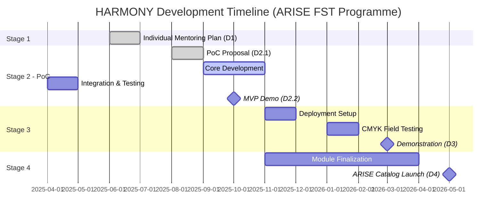

# HARMONY - Human-Robot Collaborative Packaging System

[](https://docs.ros.org/en/jazzy/)
[](https://github.com/ros4hri)
[](https://opensource.org/licenses/Apache-2.0)
[](https://arise-middleware.eu)

HARMONY provides production-ready ROS 2 modules for human-robot collaboration in packaging operations. Features adaptive pick-and-place for variable SKUs, real-time quality inspection, IoT monitoring, and FIWARE integration. Developed under EU Horizon ARISE project.

## 📋 Table of Contents
- [Architecture](#architecture)
- [Modules](#modules)
- [Installation](#installation)
- [Quick Start](#quick-start)
- [API Reference](#api-reference)
- [Development Status](#development-status)
- [Contributing](#contributing)

## 🏗️ Architecture

```
HARMONY System Architecture
├── AI Packaging Module
│   ├── Pick/Place Actions
│   ├── SKU Adaptation
│   └── Intent Processing
├── Monitoring & Analytics Module
│   ├── Quality Inspection
│   ├── IoT Integration
│   └── FIWARE Publishing
└── External Dependencies
    ├── ROS4HRI (hri_body_detect)
    ├── MoveIt2
    └── FIWARE Orion-LD
```

## 📦 Modules

### AI Packaging Module
Handles adaptive manipulation for variable packaging formats (jars, bottles, containers).

**Key Features:**
- Variable SKU handling through YAML configuration
- Intent-based control via ARISE mission controller
- Computer vision for object detection
- Adaptive gripper control

### Monitoring & Analytics Module
Provides comprehensive quality assurance and operational monitoring.

**Key Features:**
- Vision-based defect detection
- IoT sensor integration (temperature, humidity, pressure)
- Real-time KPI computation
- NGSI-LD compliant telemetry

## 🚀 Installation

### Prerequisites
```bash
# ROS 2 Jazzy
sudo apt install ros-jazzy-desktop

# MoveIt2 for Jazzy
sudo apt install ros-jazzy-moveit

# ROS4HRI packages
sudo apt install ros-jazzy-hri-msgs ros-jazzy-human-description

# Python dependencies
pip3 install opencv-python numpy pyyaml
```

### Building from Source
```bash
# Clone repository
mkdir -p ~/harmony_ws/src
cd ~/harmony_ws/src
git clone https://github.com/hpcbg/harmony.git

# Install dependencies
cd ~/harmony_ws
rosdep install --from-paths src --ignore-src -r -y

# Build
colcon build --symlink-install
source install/setup.bash
```

## 🎯 Quick Start

```bash
# Launch full system (simulation mode)
ros2 launch harmony_bringup simulation.launch.py

# Launch AI Packaging Module only
ros2 launch ai_packaging packaging_demo.launch.py

# Launch Monitoring & Analytics
ros2 launch monitoring_analytics monitoring_full.launch.py
```

## 📚 API Reference

### AI Packaging Module

#### Actions
```yaml
/ai_packaging/pick:
  type: action
  interface: harmony_msgs/action/PickItem
  goal:
    target_pose: geometry_msgs/PoseStamped
    sku_id: string
    grasp_type: string
  feedback:
    phase: string  # APPROACH, GRASP, LIFT
    progress: float
  result:
    success: bool
    error_code: string

/ai_packaging/place:
  type: action
  interface: harmony_msgs/action/PlaceItem
  goal:
    target_pose: geometry_msgs/PoseStamped
    release_height: float
  result:
    success: bool
    final_pose: geometry_msgs/PoseStamped
```

#### Services
```yaml
/ai_packaging/set_sku:
  type: harmony_msgs/srv/SetSKU
  request:
    sku_id: string
    parameters: string  # YAML blob
  response:
    success: bool
    message: string

/ai_packaging/set_speed_scaling:
  type: harmony_msgs/srv/SetSpeedScaling
  request:
    scale: float  # 0.0 to 1.0
  response:
    success: bool
```

#### Topics
```yaml
/ai_packaging/state:
  type: std_msgs/String
  values: [IDLE, BUSY, ERROR]

/ai_packaging/current_sku:
  type: harmony_msgs/SKUInfo
  fields:
    id: string
    dimensions: geometry_msgs/Vector3
    weight: float
    grasp_points: geometry_msgs/PoseArray
```

### Monitoring & Analytics Module

#### Services
```yaml
/monitoring/inspect_item:
  type: harmony_msgs/srv/InspectItem
  request:
    item_id: string
    inspection_type: string  # SEAL, FILL_LEVEL, LABEL
  response:
    passed: bool
    defects: string[]
    confidence: float

/monitoring/get_kpis:
  type: harmony_msgs/srv/GetKPIs
  request:
    time_window_sec: int32
  response:
    oee: float
    quality_rate: float
    cycle_time_avg: float
```

#### Topics
```yaml
/monitoring/quality_events:
  type: harmony_msgs/QualityEvent
  fields:
    timestamp: builtin_interfaces/Time
    item_id: string
    inspection_type: string
    passed: bool
    defect_code: string

/monitoring/system_health:
  type: diagnostic_msgs/DiagnosticArray

/monitoring/ngsi_entities:
  type: std_msgs/String  # JSON NGSI-LD entities
```

## 📊 Configuration

### SKU Configuration (`config/skus.yaml`)
```yaml
skus:
  jar_370ml:
    dimensions:
      diameter: 0.074  # meters
      height: 0.125
    weight: 0.450  # kg
    grasp_strategy: "side_grasp"
    fragility: 0.7  # 0-1 scale
    max_acceleration: 0.5
    
  jar_580ml:
    dimensions:
      diameter: 0.082
      height: 0.160
    weight: 0.680
    grasp_strategy: "top_grasp"
    fragility: 0.8
```

### Quality Parameters (`config/quality.yaml`)
```yaml
inspection:
  seal:
    min_pressure: 2.8  # bar
    max_pressure: 3.5
    tolerance: 0.1
    
  fill_level:
    nominal_ml: 370
    tolerance_ml: 5
    method: "weight_based"
    
  label:
    alignment_tolerance_deg: 2.0
    ocr_confidence_threshold: 0.85
```

## 🔧 Development Status

### Current Phase: Stage 2 - Proof of Concept

#### Completed ✅
- [x] Repository setup
- [x] Basic project structure
- [x] API design documentation
- [x] Integration with ROS4HRI defined

#### In Progress 🚧
- [ ] Core message definitions 
- [ ] Basic pick/place implementation 
- [ ] Quality inspection pipeline 
- [ ] FIWARE integration setup 

#### Upcoming 📅 
- [ ] Simulation environment 
- [ ] Integration testing 
- [ ] MVP demonstration preparation 
- [ ] D2.2 MVP delivery 

### Roadmap



## 🤝 Contributing

We welcome contributions! Please see our [Contributing Guidelines](CONTRIBUTING.md).

### Development Setup
```bash
# Install pre-commit hooks
pip install pre-commit
pre-commit install

# Run tests
colcon test --packages-select ai_packaging monitoring_analytics

# Code formatting
ament_uncrustify --reformat src/
```

## 📄 License

This project is licensed under the Apache License 2.0 - see the [LICENSE](LICENSE) file for details.

## 🙏 Acknowledgments

This project has received funding from the European Union's Horizon Europe research and innovation programme under grant agreement No 101135959 (ARISE).

### Partners
- **High Performance Creators** - Technical implementation
- **CMYK Ingredients** - Use case provider
- **ARISE Consortium** - Framework and standards

## 📧 Contact

- Technical Lead: Dr. Simeon Tsvetanov - `set@hpc.bg`
- Project Repository: https://github.com/hpcbg/harmony
- ARISE Project: https://arise-middleware.eu

---

*Last updated: September 2025*