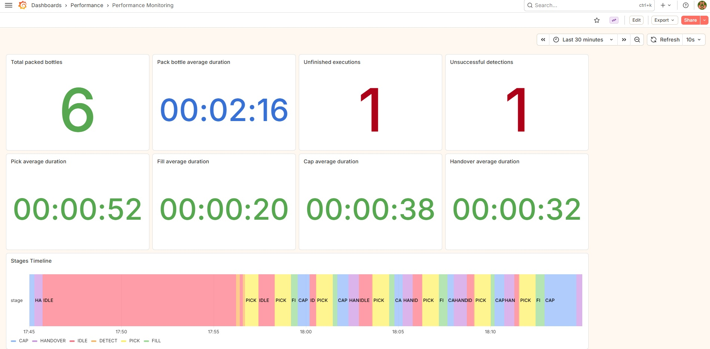
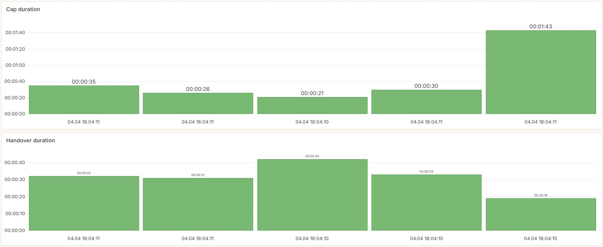

# Fiware Server and Data Analytics

This repository contains docker compose file for providing FIWARE server, saving historical data to database and tools for further analysis of the stored data.

The server allows all CORS origins.

HTTPS is not provided, so it will not work if HTTPS is required by the browser. This will be solved in further updates by using self-signed certificates.

## Stack information

The provided docker compose file contains:
1. `Orion Context Broker` for collection of the real time sensor data. It is running on port 1026.
2. `MongoDB` as a database for the latest values (no historical data is stored here).
3. `CrateDB` as a database for the historical data. You can access the GUI at [http://localhost:4200](http://localhost:4200).
4. `QuantumLeap` to store the data from Orion to the CrateDB.
5. `Grafana` as a useful tool for data analysis and dashboard creation. You access it at [http://localhost:4000](http://localhost:4000) with admin/admin credentials.
6. `curl` for setting up the Orion subscription services.

## Useful commands

- Start: `docker compose up -d` or `docker compose start`
- Stop: `docker compose stop`
- Restart: `docker compose restart`
- Check containers: `docker-compose ps
- Logs: `docker compose logs -f orion`
- Remove and start over: `docker compose down -v`
- Remove everything: `docker compose down --rmi all --volumes`
- Get version: `curl http://192.168.X.X:1026/version`
- Read value:
```sh
curl http://localhost:1026/v2/entities/test001 \
  -H 'Fiware-Service: openiot' \
  -H 'Fiware-ServicePath: /'
```
- Get all subscriptions:
```sh
curl -X GET 'http://localhost:1026/v2/subscriptions' \
  -H 'fiware-service: openiot' \
  -H 'fiware-servicepath: /' | jq
```

## CrateDB backup and restore

You can create a snapshot of the database with:
```sh
docker exec -it cratedb crash

CREATE REPOSITORY my_repo TYPE fs WITH (location = '/backups');
CREATE SNAPSHOT my_repo.snap_1 ALL;
```

You can later restore the snapshot with:
```sh
docker exec -it cratedb crash

DROP TABLE mtopeniot.ettaskpackbottle;
DROP TABLE mtopeniot.etbottledetectionjob;
DROP TABLE mtopeniot.etsensordevice;
DROP TABLE md_ets_metadata;

CREATE REPOSITORY my_repo TYPE fs WITH (location = '/backups');
CREATE REPOSITORY my_repo TYPE fs WITH (location = '/backups');
```

## Sample code for JavaScript
```js
fetch('http://192.168.X.X:1026/v2/entities', {
  headers: {
    'Fiware-Service': 'openiot',
    'Fiware-ServicePath': '/'
  }
})
.then(r => r.json())
.then(data => console.log(data))
.catch(err => console.error(err));
```

## Add new connection to CrateDB in Grafana

You can add a new data source to CrateDB as follows:
1. Go to Connections -> Data Sources -> Add data source.
2. Choose PostgreSQL.
3. Fill in:
   - Host: crate:5432
   - Database: mtopeniot (or doc)
   - User: crate
   - Password: (leave blank)
   - SSL Mode: disable
   - Important: select 12 or higher.
4. Press Save & Test. Most likely, the test will fail, but the CrateDB connection will be fine.

## Grafana dashboard

Sample dashboard is provisioned. You can see some screenshots from it down below.

[](./images/dashboard_1_640.jpg)

[](./images/dashboard_2_640.jpg)