# HARMONY — AI Packaging Module

> **ARISE D4 Shareable Module** | MIT License | ROS 2 Jazzy / Vulcanexus | FIWARE Orion v3

> ⚙️ **Branch `dds-full-integration` (exploratory — not the D4 deliverable).** On this branch the
> DDS enabler backend covers **all scalar `std_msgs` types** (String/Bool/Int32/…), not just
> `String`, and the reserved-`status`-leaf topic is handled via a `status_json` rename — see
> [`fiware_bridge/docs/dds_full_integration_plan.md`](./ros2-xarm-pack-bottle/ros2_ws/src/fiware_bridge/docs/dds_full_integration_plan.md).
> The frozen `shareable-modules` deliverable keeps the conservative String-only DDS scope.

**End user:** [CMYK Ingredients](https://www.cmykingredients.com/) &nbsp;·&nbsp;
**Technology provider:** [High Performance Creators (HPCBG)](https://hpc.bg/)

[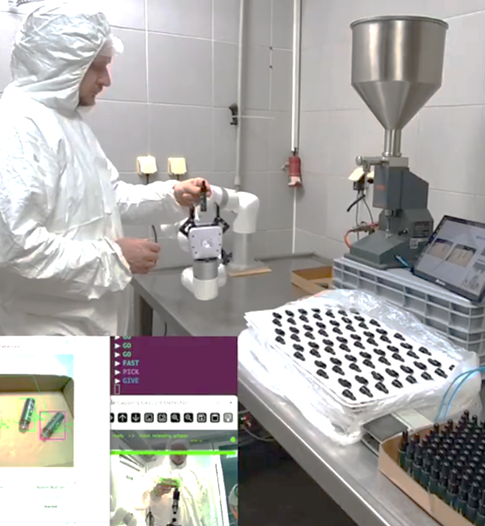](./images/industrial-setup-demo.png)

## Why this module

Together with our end user **[CMYK Ingredients](https://www.cmykingredients.com/)**, we are
addressing a critical challenge in industrial automation, with a focus on the sustainable
production and packaging of healthy food and bio-pharma ingredients. CMYK's primary goal is to
**scale production efficiency** to fuel growth and competitiveness — but current technologies fall
short in the face of **high variability in package sizes and formats**. A typical order includes
**30 distinct SKUs of 1,000 units each** — far too diverse for conventional conveyor-based systems,
and the broader product portfolio adds further constraints.

Manual production and packaging, while adaptable, imposes high physical and cognitive demands on
operators — reducing efficiency, increasing error rates, and affecting product quality. This
reinforces the urgent need for **collaborative, human-augmenting robotic systems** built on modular,
human-centric automation, enabled by adaptive HRI and the ARISE all-in-one middleware.

**HARMONY** tackles CMYK's need for efficient, high-precision packaging by deploying adaptive
robotics and advanced HRI to handle product diversity, cut setup time, and ensure consistent
quality.

Flexible packaging cells are hard to automate: the task changes often, a human still needs to
direct and supervise the robot in plain, natural ways, and a plant manager needs to *see* what
the cell is doing — throughput, state, and failures — without bolting on a separate monitoring
project afterwards.

The **AI Packaging Module** answers both needs in one deployable unit. It packages an
**AI-driven robotic packaging capability** — a robot that detects an object with computer vision
and runs a configurable pick → fill → cap → handover sequence, directed by a human through an IoT
button, voice, or hand gestures — together with a **ready-to-run monitoring & analytics stack**
(FIWARE Context Broker + time-series history + Grafana dashboards). Every command and state
change flows through a single, declarative data layer, so the same events that drive the robot
are automatically recorded, queryable over a REST API, and visualised live.

Originally the deliverable was scoped as two separate modules — an *AI Packaging* capability and
a standalone *Monitoring & Analytics* module. We **combined them** because in practice they are
only useful together: the packaging capability produces the data, and the analytics layer gives
that data meaning. Shipping them as one module means a single setup, a single hardware-free
demonstration, and a single coherent data model for a reviewer or an adopter to follow.

The result is reusable beyond bottles: swap the vision model and the YAML mapping, and the same
module drives and monitors a different AI-assisted packaging or pick-and-place task.

---

## ARISE & HARMONY Project Context

This module is a deliverable of **[ARISE](https://arise-middleware.eu/)** — the EU project
building an open middleware that lets robotics applications interoperate across **ROS 2 /
Vulcanexus** (eProsima's ROS 2 distribution) and **FIWARE** (the IoT data, history, and
dashboarding platform), targeting TRL 6-7 demonstrations of human-robot collaboration in
industrial and service environments.

**HARMONY** (*Human-Robot Automation for Modular Operations*) is a **cascade-funded** project
under ARISE, developed by HPCBG. The HARMONY demonstrator (D3) showed the end-to-end pack-bottle
task with a physical xArm-7 robot and a suite of HRI modalities (gesture, voice, IoT button, AI
vision), all integrated through the ARISE middleware stack.

This D4 deliverable extracts and packages the **AI Packaging Module** — the AI packaging
capability together with its monitoring & analytics — as installable, documented, runnable
software. The configurable **ROS 2 ↔ FIWARE bridge** (`fiware_bridge`) is the integration
backbone that ties the two halves together: it moves robot/skill state and human commands
between ROS 2 topics and FIWARE NGSI-v2 entities through a single YAML-configurable node, with no
robot-specific code, which is what makes the combined module portable to a new task.

**Module composition**

| Part of the AI Packaging Module | Lives in | Reusability |
|---|---|---|
| Integration backbone (ROS 2 ↔ FIWARE bridge) | `ros2-xarm-pack-bottle/ros2_ws/src/fiware_bridge/` | Fully generic — swap the YAML for a new task |
| AI perception (object detection) | `ai-bottle-detector-fiware/` | Reusable pattern (Fast R-CNN + FastAPI); retrain weights per object |
| Monitoring & analytics | `fiware-analytics-docker/` (Orion + CrateDB + QuantumLeap + Grafana) | Generic stack; dashboard panels are task-specific |
| Human-command inputs | `gesture-commands-fiware/`, `voice-commands-fiware/`, `iot-device-firmware/` | Reusable; gesture/keyword sets are task-specific |

---

## System Overview

The full HARMONY demonstrator is a 7-subsystem pipeline for an automated bottle pick-and-place,
fill, cap, and handover operation. The human operator interacts with the system via IoT button,
voice commands, and hand gestures. The robot responds and reports its status back through the
same FIWARE data layer.

The demonstrator was **validated at TRL 6 in a real industrial environment** — deployed in the
working space of an end user and tested with factory operators interacting with the robot for the
first time. The scenario is a *semi-automated packaging process* with a strict **human-in-the-loop**
design: although the system can act autonomously, the robot performs actions only after an explicit
operator command or clearly recognised intent, which improves safety and operator trust. This
human-centric, supervised-collaboration approach is aligned with **Industry 5.0** principles and the
ARISE objective of reusable, interoperable HRI components. Observed gains in the demonstrated setup
include reduced cycle time, lower operator workload, and improved process transparency through
live monitoring.

The high-level architecture of the AI Packaging Module is shown below:

[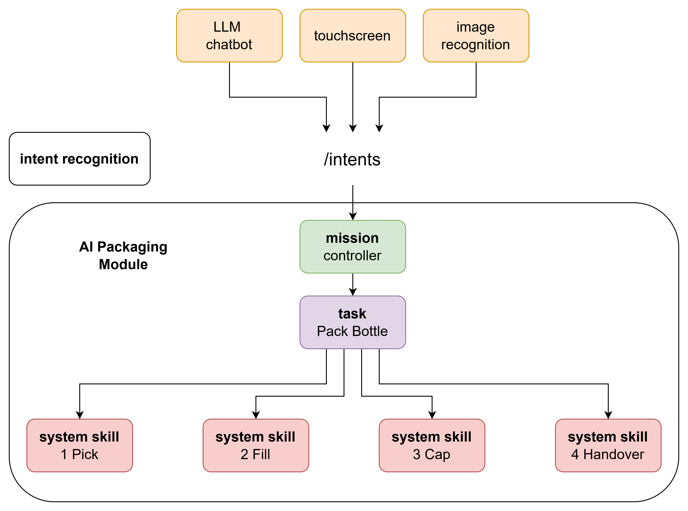](./images/ai_packaging_architecture.png)

The flow diagram of the system skill Pick is shown below:
[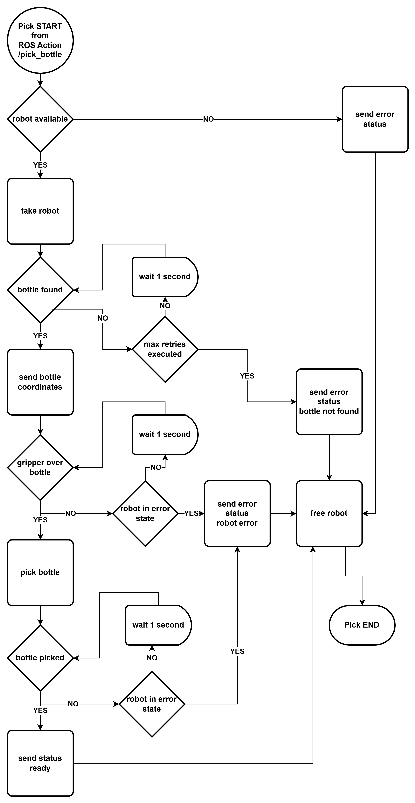](./images/pick-skill-flow.png)

The full demonstrator system architecture (all 7 subsystems) is shown here:

[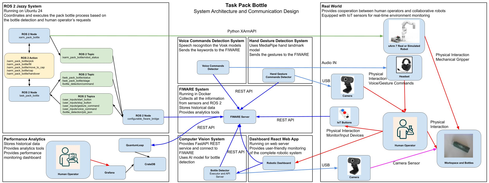](./images/system_architecture.jpg)

The system is divided into the following components.

### 1. ROS 2 System

ROS 2 coordinates the pack bottle operation. The developed ROS 2 nodes bridge between the FIWARE
platform, the AI vision system, and the xArm robot. The ROS 2 graph is shown below:

[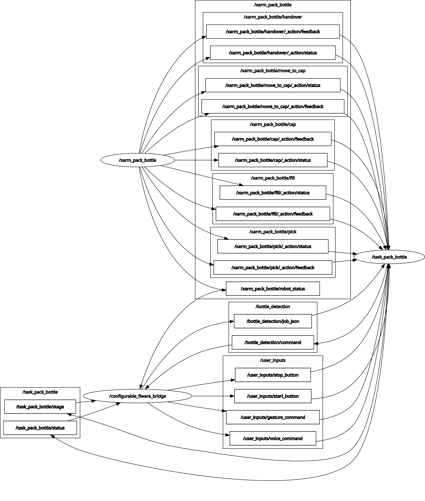](./images/rosgraph.png)

The pack bottle operation is coordinated by a node that implements its logic using the Behaviour
Tree shown in the following figure:

[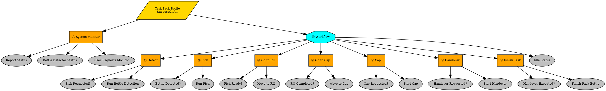](./images/pack_bottle_behaviour_tree.png)

The developed ROS 2 nodes and more details can be found in
[ros2-xarm-pack-bottle](./ros2-xarm-pack-bottle/).

### 2. AI Bottle Detector System

The AI Bottle Detector is a stand-alone vision system built on a **Fast R-CNN** model (PyTorch).
It can be executed on a dedicated GPU machine for faster inference, and provides a REST API
(FastAPI) for managing detection jobs and accessing the live camera feed, plus a notify endpoint
to work directly with FIWARE. The model can be retrained for different bottle types; tools for
dataset generation and training are included.

Before detection, the workspace plane is calibrated using a printable sheet with ArUco markers,
which lets the detector map image coordinates to robot-frame coordinates:

[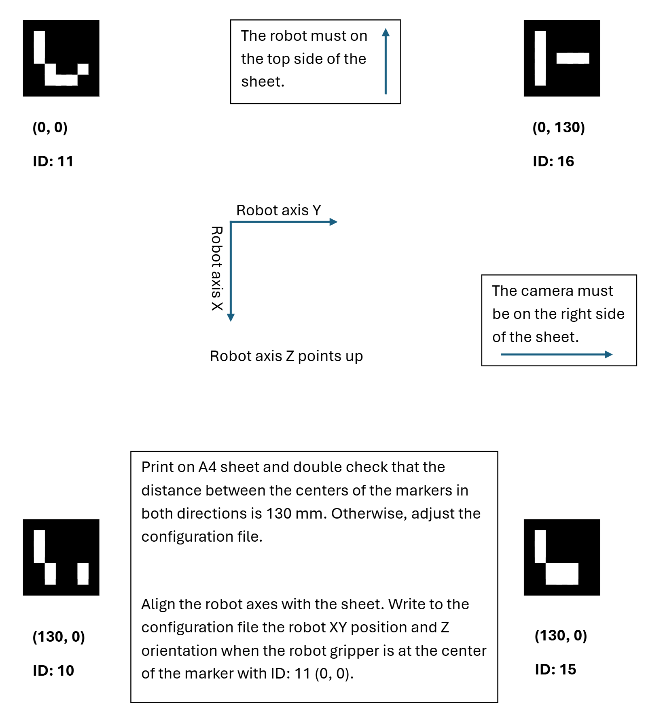](./images/ai_bottle_calibration.png)

The detector then locates each bottle and estimates its position and orientation (using the
separate `bottle` and `cap` classes to infer pose), producing the pick pose used by the robot:

[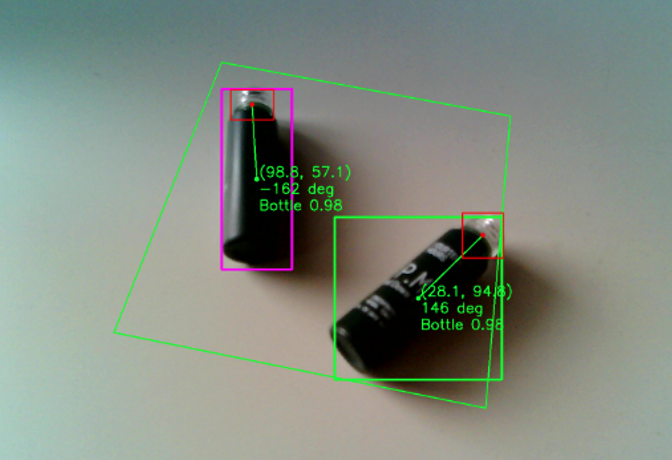](./images/ai_bottle_detection.png)

More details can be found in [ai-bottle-detector-fiware](./ai-bottle-detector-fiware/).

### 3. FIWARE Platform for Communication and Data Analytics

FIWARE is used as the central storage for data generated by all system modules. It provides a
REST API for further data access. The only data not stored in FIWARE are raw images — instead,
URLs generated by the AI vision system are stored.

All historical data is also persisted in a CrateDB database via QuantumLeap and visualised in a
Grafana dashboard. A screenshot of the analytics dashboard is shown below:

[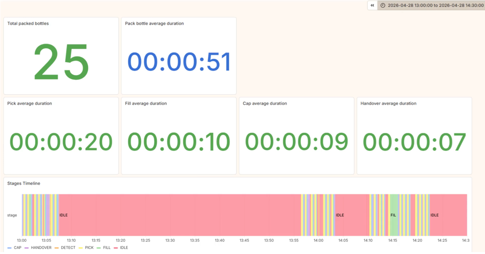](./images/analytics_dashboard.png)

Because every event passes through the FIWARE data layer, per-cycle performance can be analysed
directly from the recorded history — for example, the detection and pick durations of each cycle:

[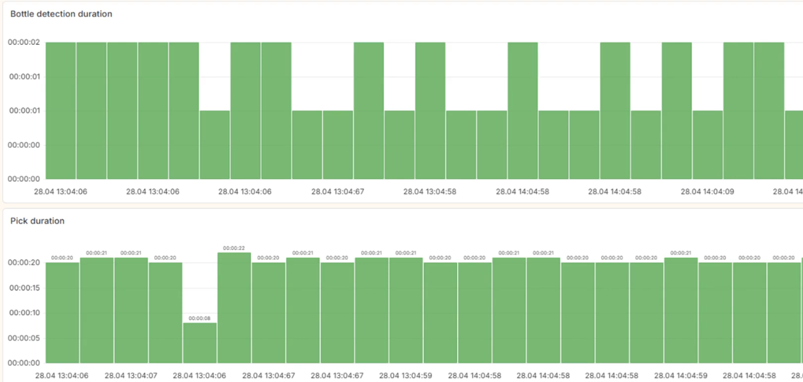](./images/detection-and-pick-duration.png)

More details can be found in [fiware-analytics-docker](./fiware-analytics-docker/).

### 4. Hand Gesture Recognition

Hand gesture commands are recognised and sent to FIWARE using the MediaPipe hand landmark model.
Recognised gestures:

- `NO_HAND` — no hand present.
- `CAP_PLACED` — middle and index fingers pointed downwards, hand stationary.
- `SIDE_GRIP` — middle and index fingers pointed horizontally, hand stationary.

The recogniser extracts hand landmarks and classifies the gesture into a command intent that is
published to FIWARE. Like ROS4HRI, it builds on Google MediaPipe body estimation (focused on the
hand) and can be seen as a hand-gesture *extension* of the ROS4HRI perception surface.

| Cap intent | Give intent |
|---|---|
| [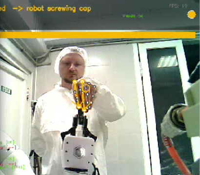](./images/gesture_cap_intent.png) | [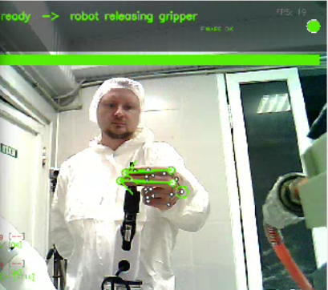](./images/gesture_give_intent.png) |

More details can be found in [gesture-commands-fiware](./gesture-commands-fiware/).

### 5. Voice Commands Recognition

This module listens for predefined voice keywords using the Vosk speech recognition models. The
default keyword set is: GO, STOP, PICK, CAP, GIVE, SAFE, FAST. Recognised keywords are published
to FIWARE and consumed by the ROS 2 task orchestration. The recognition pipeline (audio input →
keyword spotting → FIWARE command) is illustrated below:

[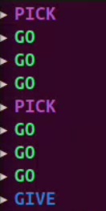](./images/voice_command_pipeline.png)

More details can be found in [voice-commands-fiware](./voice-commands-fiware/).

### 6. React Dashboard Web Application

A fully customisable React Dashboard with widget-based pages for visualising system data and
state.

[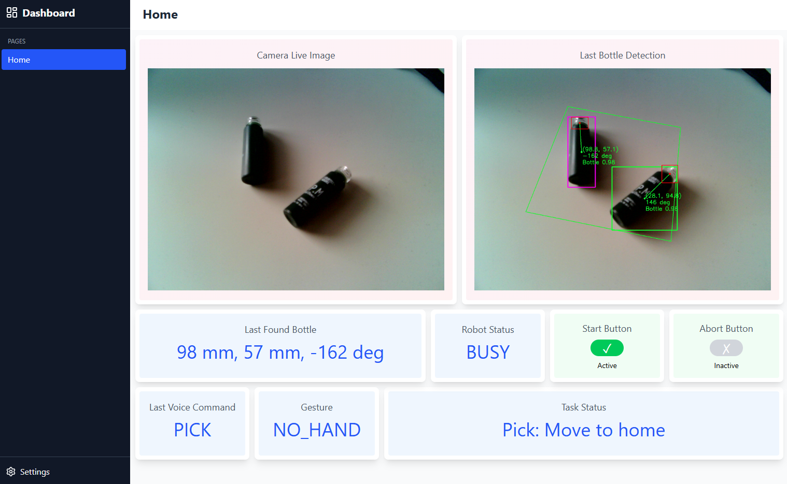](./images/react_dashboard_screenshot.png)

More details can be found in [react-dashboard](./react-dashboard/).

### 7. IoT Devices

M5Stack IoT devices are used to send operator commands via HTTP requests to FIWARE. Sample
Arduino firmware is in [iot-device-firmware](./iot-device-firmware/).

---

## Interfaces

### ROS 2 Topics

The following topics are used by the HARMONY demonstrator and bridged via the `fiware_bridge`
module. All custom message types are defined in the `custom_interfaces` package.

| Direction | Topic | Message type | Description |
|---|---|---|---|
| Input → ROS 2 | `/user_inputs/gesture_command` | `std_msgs/String` | Gesture class from MediaPipe |
| Input → ROS 2 | `/user_inputs/voice_command` | `std_msgs/String` | Recognised keyword from Vosk |
| Input → ROS 2 | `/user_inputs/start_button` | `std_msgs/Bool` | Blue button pressed (M5Stack) |
| Input → ROS 2 | `/user_inputs/stop_button` | `std_msgs/Bool` | Red button pressed (M5Stack) |
| Perception | `/bottle_detection/command` | `std_msgs/String` | Command sent to AI detector |
| Perception | `/bottle_detection/job_json` | `std_msgs/String` | Detection result JSON (base64; **node backend only** — DDS can't decode) |
| Skill | `/system_skill_pick_and_place/status_json` | `std_msgs/String` | Pick-and-place skill status (`status_json` leaf bridges on DDS) |
| Task | `/task_pack_bottle/stage` | `std_msgs/String` | Current behaviour-tree stage |
| Task | `/task_pack_bottle/status_json` | `std_msgs/String` | Overall task status (`status_json` leaf bridges on DDS) |
| Arm | `/xarm_pack_bottle/pick` | `std_msgs/String` | Arm pick action trigger |
| Arm | `/xarm_pack_bottle/fill` | `std_msgs/String` | Arm fill action trigger |
| Arm | `/xarm_pack_bottle/cap` | `std_msgs/String` | Arm cap action trigger |
| Arm | `/xarm_pack_bottle/handover` | `std_msgs/String` | Arm handover action trigger |
| Arm | `/xarm_pack_bottle/robot_status` | `std_msgs/String` | Robot status feedback |

**ROS 2 distribution:** ROS 2 Jazzy Jalisco (Ubuntu 24.04 Noble). The package is also compatible
with Vulcanexus (eProsima's ROS 2 distribution used in the ARISE middleware stack), as Vulcanexus
is a superset of standard ROS 2.

### FIWARE / NGSI-v2 Entities

The bridge reads from and writes to the following NGSI-v2 entities on the Orion Context Broker.
All entities use `Fiware-Service: openiot` and `Fiware-ServicePath: /`.

| Entity ID | Type | Key Attribute | Direction | Source |
|---|---|---|---|---|
| `M5Stick:001` | `Device` | `buttonBlue`, `buttonRed`, `angle` | FIWARE → ROS 2 | IoT device |
| `VoiceCommand:operator-1` | `Command` | `command` | FIWARE → ROS 2 | voice module |
| `GestureDetector:operator-1` | `Command` | `command` | FIWARE → ROS 2 | gesture module |
| `SystemSkillPickAndPlace` | `Status` | `status` | ROS 2 → FIWARE | ROS 2 node |

**Sample NGSI-v2 payload** (entity update from bridge):

```json
{
  "status": {
    "type": "Text",
    "value": "IDLE",
    "metadata": {
      "dateModified": {
        "type": "DateTime",
        "value": "2024-05-10T12:34:56.789Z"
      }
    }
  }
}
```

The bridge polls Orion at a configurable interval (default 1 s) using `GET /v2/entities/<id>?attrs=<attr>&metadata=dateModified` and only re-publishes to ROS 2 when the `dateModified` timestamp changes — preventing redundant topic floods.

### FIWARE Bridge Backends (custom node vs. DDS enabler)

The module ships **two interchangeable bridge backends**, selected at launch with
`bridge_backend:=node|dds`. The custom node is the default; the DDS enabler is the ARISE-native
opt-in. Existing behaviour is unchanged unless you explicitly choose `dds`.

| | `bridge_backend:=node` (default) | `bridge_backend:=dds` (opt-in) |
|---|---|---|
| How | Custom Python node (`configurable_fiware_bridge`) over NGSI-v2 HTTP REST | **Orion-LD built-in DDS bridge** (`-wip dds -mongocOnly`) reading `context_broker_config.json` — no custom node runs |
| API | NGSI-v2 (Orion 3.10.1) | NGSI-LD (Orion-LD) |
| Topic types | All (`String`, `Bool`, `Int32`, value-mapping, base64) | **All scalar `std_msgs`** (`String`/`Bool`/`Int32`/…) — `rt/<topic>` → `.<attr>.value.data`; no `value_mapping`/base64 |
| Infra | Standard Orion; no DDS plugin | DDS-capable Orion-LD; host networking |
| ARISE alignment | Demonstrator-proven path | ARISE "DDS enabler" interoperability path |

**Custom node** — chosen for the demonstrator because mappings are fully declarative (YAML, no
code per app), the FIWARE side needs only a standard Orion broker, and HTTP REST is portable
across LANs and Docker bridges. It carries all topic types and reproduces the node-only transforms
(`value_mapping`, base64) that the DDS enabler does not.

**DDS enabler** — the ARISE-native alternative: ROS 2 / Vulcanexus DDS topics are mapped straight
into Orion-LD as NGSI-LD entities, with no bridge node at all. On this branch it covers **all
scalar `std_msgs` topics** — the bridge maps each via DDS dynamic-type discovery as
`.<attr>.value.data` (String→JSON string, Bool→JSON bool, Int→JSON number). The node-only
transforms (`value_mapping`, base64) are **not** reproduced, so wire native values upstream (PATCH a
real boolean, not `"ON"`). Everything needed to run it — the config generator, the generated
mapping, a DDS-capable `docker-compose`, and a hardware-free hello world — lives in
[`ros2-xarm-pack-bottle/ros2_ws/src/fiware_bridge/dds/`](./ros2-xarm-pack-bottle/ros2_ws/src/fiware_bridge/dds/),
with the per-class strategy and validation in
[`fiware_bridge/docs/dds_full_integration_plan.md`](./ros2-xarm-pack-bottle/ros2_ws/src/fiware_bridge/docs/dds_full_integration_plan.md).
A single YAML mapping (`bridge_config.yaml`) drives **both** backends, so they never drift.

This path was **validated end-to-end** (Orion-LD `1.13.0-PRE-1835`, publishing from the
`eprosima/vulcanexus:jazzy-desktop` container): all six bridged topics round-trip in both directions
(ROS→FIWARE and FIWARE→ROS via `PATCH`) — `voice_command`/`gesture_command` (`String`), `/angle`
(`Int32`), `/user_inputs/start_button`/`/user_inputs/stop_button` (`Bool`), and
`/system_skill_pick_and_place/status_json` (`String`). Two notes: (1) the DDS broker uses **NGSI-LD
on Orion-LD**, a separate broker from the default NGSI-v2 stack, on the same host port `1026`;
(2) ⚠️ a topic whose **leaf segment is exactly `status`** is not delivered by Orion-LD's DDS module
(it collides with ROS 2 actions' `status`/`GoalStatusArray`) — **resolved here** by renaming the ROS
leaf to `status_json` (the FIWARE attribute stays `status`, so NGSI consumers are unaffected). Use
the **Vulcanexus Docker image** for the ROS 2 side — ARISE fixes Fast DDS as the middleware, and the
container guarantees that environment without touching a host ROS install.

```bash
# default (custom node) — unchanged
ros2 launch fiware_bridge fiware_bridge.launch.py

# ARISE-native DDS enabler (node not started; Orion-LD does the bridging)
cd ros2-xarm-pack-bottle/ros2_ws/src/fiware_bridge/dds
python3 generate_config.py
docker compose -f docker-compose.dds.yml up -d
ros2 launch fiware_bridge fiware_bridge.launch.py bridge_backend:=dds
```

### ROS4HRI Alignment

The AI Packaging Module operates at the **command/intent layer** — it consumes post-processed
intent signals (gesture class string, voice keyword string, button press boolean) rather than raw
human-perception streams. The ROS4HRI standard (`hri_msgs`) defines perception-level topics
(`/humans/persons/*`, `/humans/voices/*`, `/humans/bodies/*`) which are upstream of this layer.
The table below documents the alignment and justifies the gaps:

| HRI concept | Signal in HARMONY | ROS4HRI alignment | Justification |
|---|---|---|---|
| Gesture intent | `/user_inputs/gesture_command` (std_msgs/String) | **Extension** — custom topic | No ROS4HRI gesture-intent standard exists. Signal is a classified gesture string (e.g. `CAP_PLACED`), not a raw body pose. |
| Speech intent | `/user_inputs/voice_command` (std_msgs/String) | **Extension** — custom topic | No ROS4HRI speech-intent standard exists. Signal is a recognised keyword string (e.g. `PICK`), downstream of Vosk ASR. |
| Operator state | `/user_inputs/start_button`, `/user_inputs/stop_button` (std_msgs/Bool) | **N/A** — operator control, not human perception | Start/stop buttons are control signals, not human-state observations. |
| Human presence | Not implemented in this release | **Planned** | Future integration with `hri_body_detect` (PAL Robotics) will publish ROS4HRI-compliant `/humans/bodies/*` topics. Gesture and voice pipelines can be gated on human presence once that integration is complete. |

---

## Installation

### Prerequisites

| Dependency | Version | Required for | Notes |
|---|---|---|---|
| Ubuntu | 24.04 (Noble) | All | Tested OS |
| ROS 2 Jazzy or Vulcanexus | Jazzy / latest | `fiware_bridge`, ROS 2 nodes | See `install_prerequisites.sh` |
| Docker + Docker Compose v2 | ≥ 24 / v2 | FIWARE analytics stack | Installed by `install_prerequisites.sh` |
| Python | 3.10+ | All Python modules | Bundled with Ubuntu 24.04 |
| `requests` | ≥ 2.28 | `fiware_bridge` | In `requirements.txt` (`pip install -r requirements.txt`) |
| `pyyaml` | ≥ 6.0 | `fiware_bridge` | In `requirements.txt` (`pip install -r requirements.txt`) |
| Node.js / npm | ≥ 18 | React dashboard only | Installed by `install_prerequisites.sh` |
| MediaPipe | ≥ 0.10 | Gesture module only | `pip install -r gesture-commands-fiware/requirements.txt` |
| Vosk | ≥ 0.3 | Voice module only | `pip install -r voice-commands-fiware/requirements.txt` |
| xArm SDK | latest | Robot arm only | Closed-source vendor SDK; **not required for hello world** |
| xArm-7 robot | hardware | Robot arm only | **Not required for hello world** |
| USB camera | hardware | AI detector only | **Not required for hello world** |
| Microphone | hardware | Voice module only | **Not required for hello world** |

**Simulation / hardware-free path:** the `fiware_bridge` and the FIWARE analytics stack can be
fully exercised without robot hardware, a camera, or a microphone. The hello world below uses
this path.

### Option A — Guided setup with the Setup Assistant (recommended)

The repository ships a **Setup Assistant** (`setup.py`) that automates both first-time
installation and daily startup. It is a pure-Python wizard (no extra dependencies) that:

- creates the Python virtual environments (`venv` for the gesture/voice modules and a
  separate `torch_venv` for the AI detector, since PyTorch must be installed against the
  correct CPU/CUDA wheel),
- installs each module's `requirements.txt`,
- runs `colcon build` on the ROS 2 workspace,
- generates the per-module config files, and
- on subsequent runs, checks readiness and launches the selected services in separate
  terminal tabs.

```bash
python3 setup.py
# Choose "First-time Install" on the first run, "Daily Startup" thereafter.
```

The Setup Assistant calls `install_prerequisites.sh` under the hood for the system-level
packages (Docker, Node.js, ROS 2 Jazzy). You can also run that script on its own — see
Option B.

### Option B — Manual installation

**1. System packages.** Run the provided install script to install Docker, Node.js, and
ROS 2 Jazzy:

```bash
chmod +x install_prerequisites.sh
./install_prerequisites.sh
```

**2. Python virtual environment.** Create and activate a venv, then install the bridge
dependencies (this is all that is needed for the `fiware_bridge` hello world):

```bash
python3 -m venv venv
source venv/bin/activate
pip install -r requirements.txt          # requests + pyyaml
```

**3. Optional HRI modules.** Install only the ones you need (the AI detector needs a
PyTorch wheel and is best handled by the Setup Assistant's dedicated `torch_venv`):

```bash
# Gesture recognition (optional)
pip install -r gesture-commands-fiware/requirements.txt

# Voice recognition (optional — also requires: sudo apt install portaudio19-dev)
pip install -r voice-commands-fiware/requirements.txt
```

**4. Build the ROS 2 workspace:**

```bash
cd ros2-xarm-pack-bottle/ros2_ws
rosdep install --from-paths src --ignore-src -r -y
colcon build --symlink-install
source install/setup.bash
```

---

## Hello World (No Robot Required)

This hello world verifies the AI Packaging Module's integration backbone — the `fiware_bridge`
node and the FIWARE monitoring stack — by exchanging data with a local FIWARE Orion instance in
both directions, **without any robot hardware, camera, or microphone**. It exercises the same data
path that carries human commands and robot/skill state during a real packaging run.

**Step 1 — Start FIWARE**

```bash
cd fiware-analytics-docker
docker compose up -d
# Wait ~10 s for Orion to become ready
curl -s http://localhost:1026/version | python3 -m json.tool
```

Expected: JSON response showing Orion version `3.10.1`.

**Step 2 — Build and launch the bridge**

```bash
cd ros2-xarm-pack-bottle/ros2_ws
source install/setup.bash
ros2 launch fiware_bridge fiware_bridge.launch.py
```

Expected log output:

```
[configurable_fiware_bridge]: Configurable FIWARE Bridge started!
[configurable_fiware_bridge]: FIWARE: localhost:1026
[configurable_fiware_bridge]: Service: openiot
[configurable_fiware_bridge]: ROS2 → FIWARE mappings:
[configurable_fiware_bridge]:   /system_skill_pick_and_place/status → SystemSkillPickAndPlace.status
```

**Step 3 — Publish a mock ROS 2 message**

In a second terminal:

```bash
source ros2-xarm-pack-bottle/ros2_ws/install/setup.bash
ros2 topic pub /system_skill_pick_and_place/status std_msgs/msg/String \
  "data: 'IDLE'" --once
```

**Step 4 — Verify in FIWARE**

```bash
curl -s \
  -H "Fiware-Service: openiot" \
  -H "Fiware-ServicePath: /" \
  http://localhost:1026/v2/entities/SystemSkillPickAndPlace \
  | python3 -m json.tool
```

Expected: a JSON entity with `"status": {"type": "Text", "value": "IDLE", ...}`.

**Step 5 — Verify FIWARE → ROS 2 direction**

Simulate an IoT button press by POSTing directly to Orion:

```bash
# Create the entity if it doesn't exist yet
curl -s -o /dev/null -w "%{http_code}" -X POST \
  http://localhost:1026/v2/entities \
  -H "Content-Type: application/json" \
  -H "Fiware-Service: openiot" \
  -H "Fiware-ServicePath: /" \
  -d '{"id":"M5Stick:001","type":"Device","buttonBlue":{"type":"Text","value":"ON"}}'

# Then watch the ROS 2 topic in another terminal:
ros2 topic echo /start_button
```

Expected: `data: true` published within 1 second (one polling interval).

### Optional Next Step — Bring up the AI perception service

The steps above verify the integration + monitoring backbone with **no extra hardware**. To also
exercise the AI perception half of the module, you can start the AI Bottle Detector service. The
**service itself starts without a robot**, registers its FIWARE entity, and exposes its REST API —
so you can verify it is wired in. Running an actual *detection*, however, requires a GPU
PyTorch environment, a camera (or RTSP stream), and trained model weights (`*.pth`, not shipped in
the repo — see [Known Limitations](#known-limitations)).

**1. Configure.** Copy the template and set your camera ID/URL and model path:

```bash
cd ai-bottle-detector-fiware
cp config/config.json.tpl config/config.json
# edit config/config.json: CAMERA (device id or RTSP URL), MODEL_PATH, APP_API_HOST
```

**2. Start the service** (FIWARE from Step 1 must be running). The setup assistant's `torch_venv`
is the recommended environment, since PyTorch must match your CPU/CUDA:

```bash
source ../torch_venv/bin/activate     # created by setup.py; or your own torch env
pip install -r requirements.txt        # FastAPI, OpenCV, etc. (torch installed separately)
./run.sh                               # uvicorn main:app --host 0.0.0.0 --port 22001
```

**3. Verify the service is up and registered in FIWARE:**

```bash
# REST API health check
curl -s http://localhost:22001/health | python3 -m json.tool
# Interactive API docs (open in a browser):  http://localhost:22001/docs

# The detector auto-creates its job entity in FIWARE on startup:
curl -s \
  -H "Fiware-Service: openiot" -H "Fiware-ServicePath: /" \
  http://localhost:1026/v2/entities/BottleDetectionJob:processor-01 \
  | python3 -m json.tool
```

Expected: `/health` returns a JSON object (`"camera": false` is normal with no camera attached),
and the `BottleDetectionJob:processor-01` entity exists in Orion with `status: "IDLE"`.

**4. (Full path — needs camera + weights) Trigger a detection** through FIWARE, exactly as the
ROS 2 task does. Set the detector's `command` attribute to `START`; the service runs a job and
writes the bottle count and pick pose back to the same entity:

```bash
curl -s -X PATCH \
  http://localhost:1026/v2/entities/BottleDetectionJob:processor-01/attrs \
  -H "Content-Type: application/json" \
  -H "Fiware-Service: openiot" -H "Fiware-ServicePath: /" \
  -d '{"command":{"type":"Text","value":"START"}}'

# Then re-read the entity — status progresses CREATED → CAPTURING → PROCESSING → DONE
```

This closes the loop: a FIWARE command drives the AI perception, and the result flows back through
the same monitored data layer that the bridge uses — the two halves of the AI Packaging Module
working together.

---

## Basic Demo — Full System

This section describes the complete demonstrator startup for reference.

**Scenario:** human operator presses a button or says "GO PICK" → robot detects a bottle, picks
it up, fills it, caps it, and hands it over. The entire operation state is logged in FIWARE and
visible on the Grafana and React dashboards.

**Prerequisites:** complete hardware setup (xArm-7, camera, microphone, M5Stack button),
configuration files created as described in the per-module READMEs.

```bash
# 1. FIWARE stack
cd fiware-analytics-docker && docker compose start

# 2. AI Bottle Detector
cd ai-bottle-detector-fiware && . ./run.sh

# 3. ROS 2 nodes (includes fiware_bridge)
cd ros2-xarm-pack-bottle && . ./run.sh

# 4. Gesture recognition
cd gesture-commands-fiware && . ./run.sh

# 5. Voice recognition
cd voice-commands-fiware && . ./run.sh

# 6. React Dashboard (optional)
cd react-dashboard && . ./run.sh
```

Alternatively, use the top-level launch script: `./launch_pack_bottle.sh`

**Operator input:** press the blue button on the M5Stack, or say "GO PICK".

**Expected output:** robot executes the pick-fill-cap-handover sequence; all stages appear in the
Grafana analytics dashboard at `http://localhost:4000` (default credentials: admin / admin).

### Video Demonstration

Pack bottle operation with the xArm robot:

[](https://youtu.be/EWTFuBgDNAE)

Pack bottle operation with an educational/research cobot:

[](https://youtu.be/xAtnlniCpGE)

Pack bottle operation in idustrial setup:

[](https://youtu.be/Lhe4MJ5kDoQ)

> **Note:** in these demonstrations the settings are tuned to **showcase the human-robot
> interaction**, not to maximise throughput. Robot speeds and dwell times are deliberately
> conservative so the multimodal HRI (voice, gesture, IoT button) is clearly visible; they are not
> indicative of the cell's achievable cycle-time performance.

### Reuse for cylindrical objects — pick fixtures

The module is **task-agnostic**: swap the vision model and the YAML topic/entity mapping and it
drives and monitors a different AI-assisted pick-and-place task. For the demonstrated use case —
picking **cylindrical objects (bottles)** — picking accuracy and repeatability are improved by
simple **3D-printed fixtures** that constrain the object's starting pose, reducing the burden on
perception and grasp planning:

[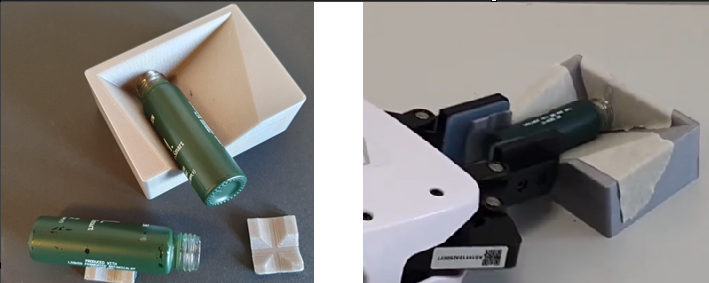](./images/3d-printed-fixtures.png)

---

## Repository Structure

```
harmony/
├── README.md                          # This file — D4 module entry point
├── LICENSE                            # MIT
├── requirements.txt                   # Python deps for the fiware_bridge module
├── setup.py                           # Setup Assistant (install wizard + daily launcher)
├── install_prerequisites.sh           # System-level install (Docker, ROS 2, Node.js)
├── launch_pack_bottle.sh              # One-shot full-system launcher
├── images/                            # Architecture diagrams, screenshots
├── ros2-xarm-pack-bottle/
│   └── ros2_ws/src/
│       ├── fiware_bridge/             # ← integration backbone (ROS 2 ↔ FIWARE bridge)
│       │   ├── fiware_bridge/configurable_fiware_bridge.py
│       │   ├── config/bridge_config.yaml   # single source of truth (both backends)
│       │   ├── launch/fiware_bridge.launch.py   # bridge_backend:=node|dds
│       │   ├── docs/bridge_inventory.md    # per-topic DDS-eligibility analysis
│       │   └── dds/                        # optional Orion-LD DDS-enabler backend
│       │       ├── generate_config.py
│       │       ├── context_broker_config.json
│       │       ├── docker-compose.dds.yml
│       │       └── README.md               # DDS hello world
│       ├── custom_interfaces/         # ROS 2 message/action definitions
│       ├── task_pack_bottle/          # Behaviour tree (demonstrator-specific)
│       ├── xarm_pack_bottle/          # xArm arm actions (demonstrator-specific)
│       └── edubot_pack_bottle/        # Edubot arm actions (demonstrator-specific)
├── ai-bottle-detector-fiware/         # Fast R-CNN + FastAPI detector (demonstrator-specific)
├── fiware-analytics-docker/           # Orion + CrateDB + QuantumLeap + Grafana stack
├── gesture-commands-fiware/           # MediaPipe gesture → FIWARE
├── voice-commands-fiware/             # Vosk ASR → FIWARE
├── react-dashboard/                   # React visualisation dashboard
└── iot-device-firmware/               # M5Stack Arduino firmware
```

**Role of each component in the demonstrator** vs. reusable module status:

| Component | Reusable as-is | Demonstrator-specific parts |
|---|---|---|
| `fiware_bridge` | Yes — any ROS 2 ↔ FIWARE use case | Config YAML is bottle/xArm-specific; swap the YAML for a new use case |
| `custom_interfaces` | Partially — `std_msgs` types only in bridge | Action types are bottle-task-specific |
| `gesture-commands-fiware` | Yes — any gesture → FIWARE integration | Gesture classes (`CAP_PLACED`, `SIDE_GRIP`) are task-specific; re-train MediaPipe labels |
| `voice-commands-fiware` | Yes — any keyword → FIWARE integration | Keyword set is bottle-task-specific; change the keyword list |
| `fiware-analytics-docker` | Yes — generic FIWARE stack | Grafana dashboard panels are bottle-task-specific |
| `ai-bottle-detector-fiware` | Partially — Fast R-CNN + FastAPI pattern is reusable | Model weights and class names are bottle-specific |
| `task_pack_bottle` | No | Entirely bottle-task-specific behaviour tree |
| `xarm_pack_bottle` / `edubot_pack_bottle` | No | xArm-7 / Edubot hardware-specific |

---

## Known Limitations

- **Hardware coupling:** the full demonstrator requires an xArm-7 or Edubot robot, a USB camera,
  an M5Stack IoT device, and a microphone. The `fiware_bridge` itself has no hardware
  dependency.
- **Polling latency:** FIWARE → ROS 2 data delivery depends on the polling interval (default 1 s).
  This is acceptable for HRI command signals but is not suitable for high-frequency sensor data.
- **NGSI-v2 on the default backend:** the custom node (`bridge_backend:=node`) targets the FIWARE
  NGSI-v2 API. NGSI-LD is available via the optional `bridge_backend:=dds` (Orion-LD) path, which on
  this branch covers all scalar `std_msgs` types (String/Bool/Int32/…); only the node-only transforms
  (`value_mapping`, base64) and `custom_interfaces/*` types remain node-only — see
  [FIWARE Bridge Backends](#fiware-bridge-backends-custom-node-vs-dds-enabler).
- **Single-attribute polling:** the bridge polls individual attributes per entity. Polling
  efficiency degrades with a large number of mapped attributes.
- **Gesture classes are task-specific:** the MediaPipe gesture recogniser is trained on
  `CAP_PLACED` and `SIDE_GRIP` gestures that are specific to the bottle-cap operation. Reuse
  requires retraining or re-labelling.
- **Model weights:** the AI detector uses Fast R-CNN weights (PyTorch/torchvision) trained on
  bottle images. These weights (`*.pth`) are not included in the repository; retraining is
  required for other object classes. Tools for dataset generation and training are provided.
- **Tested on Ubuntu 24.04 only:** other Linux distributions and Windows/macOS are not tested.
- **No authentication:** the FIWARE Orion instance runs without authentication in the default
  configuration. Production deployments must add Keyrock/PEP Proxy authentication.

---

## Ad-hoc Components, Proprietary Dependencies, and Future Work

**Ad-hoc / demonstrator-specific:**
- `bridge_config.yaml` contains entity IDs and topic names specific to the pack-bottle task;
  a new application must supply its own YAML.
- The behaviour tree in `task_pack_bottle` encodes the exact bottle-pick-fill-cap-handover
  sequence and is not intended for reuse.
- Robot joint angles and workspace coordinates in `xarm_pack_bottle/config/` are
  calibrated for the specific laboratory setup.

**Proprietary dependencies:**
- The xArm-7 robot requires the UFactory xArm Python SDK (open source, MIT) but communicates
  with proprietary firmware on the robot controller.
- The Edubot educational cobot uses a vendor-specific interface library.
- Neither robot SDK is required to run the `fiware_bridge` hello world.

**Untested configurations:**
- Multi-robot or multi-operator scenarios (single operator, single arm only tested).
- FIWARE deployments behind a reverse proxy or with HTTPS.
- Vulcanexus-specific DDS QoS profiles have not been validated; standard ROS 2 defaults are used.
- ROS 2 bag file replay as a substitute for live sensor data (planned but not tested).

**Future work:**
- ✅ **Done (this branch):** the **DDS backend** now covers non-`String` topics — `Bool`/`Int32`
  M5Stack inputs and the renamed `status_json` topic all round-trip over DDS (see
  [`dds_full_integration_plan.md`](./ros2-xarm-pack-bottle/ros2_ws/src/fiware_bridge/docs/dds_full_integration_plan.md)).
  Remaining: validate it as the *primary* backend for the full demonstrator (currently the custom
  node stays the default).
- Bring NGSI-LD (`@context`-aware payloads) to the custom node backend as well, for parity with
  the DDS path.
- Integrate `hri_body_detect` (PAL Robotics) to publish ROS4HRI-compliant `/humans/bodies/*`
  topics and gate gesture/voice commands on confirmed human presence.
- Add a subscription-based (FIWARE notification) path alongside polling to reduce latency.
- Provide a Docker image for the `fiware_bridge` node to simplify deployment.

---

## Maintainer

| Field | Value |
|---|---|
| Name | Simeon Tsvetanov |
| Organisation | HPCBG |
| Email | set@hpc.bg |
| GitHub | [hpcbg/harmony](https://github.com/hpcbg/harmony) |

---

## Licensing Information

All source code in this repository is released under the **MIT License** — see [LICENSE](./LICENSE).

Third-party runtime dependencies and their licenses:

| Dependency | License | Notes |
|---|---|---|
| ROS 2 Jazzy | Apache 2.0 | System middleware |
| FIWARE Orion | AGPL-3.0 | Context Broker (self-hosted) |
| QuantumLeap | MIT | Time-series bridge |
| CrateDB | Apache 2.0 (community) | Time-series database |
| Grafana | AGPL-3.0 | Dashboard (self-hosted) |
| MediaPipe | Apache 2.0 | Gesture recognition |
| Vosk | Apache 2.0 | Speech recognition |
| PyTorch | BSD 3-Clause | AI model runtime |
| torchvision (Fast R-CNN) | BSD 3-Clause | Object detection model |
| FastAPI | MIT | REST API for AI detector |
| requests | Apache 2.0 | HTTP client in bridge |
| PyYAML | MIT | Config parsing in bridge |

The `fiware_bridge` node itself depends only on `requests` and `pyyaml` (both permissive), plus
the ROS 2 runtime (Apache 2.0). It can be shipped as a standalone MIT-licensed package without
pulling in any AGPL dependency.

---

## Repository Information

This repository is the D4 deliverable extracted from the HARMONY demonstrator (`hpcbg/harmony-dev`).
The demonstrator history and provenance are preserved in `harmony-dev`. This repository contains
only the stable, reviewed module intended for ARISE evaluation.

When contributing using Git subtree do **not** use `--squash` so that the original commit history
is preserved.
