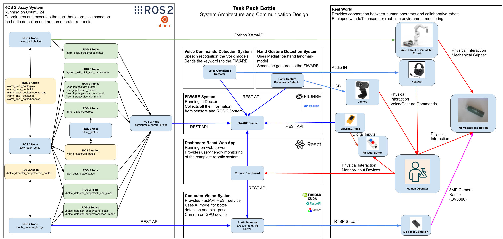
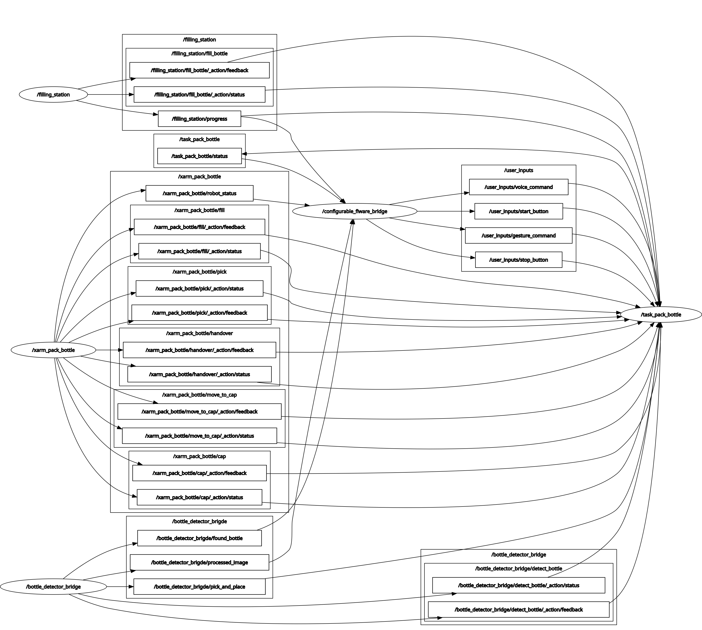
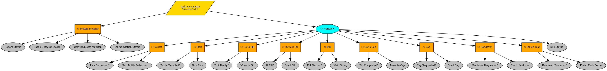
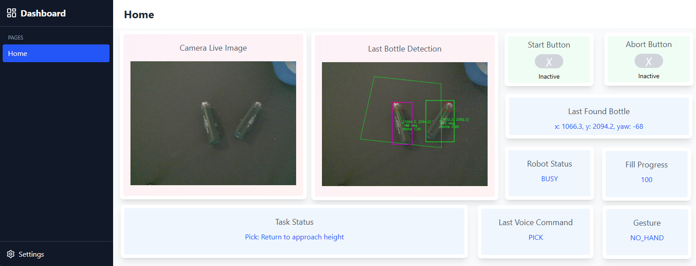

# ROS 2 Pack Bottle Operation

This folder contains the proposed architecture of the pack bottle for interaction between human and robot for a request of bottle pick and place, fill, cap and handover operation.

The human operator can use IoT device, voice or gesture commands to request the automatic bottle picking process, cap and handover operations. If there are no bottle left the operator can abort the process so that the operator can safely load new bottles in the bin.

The system is using a pretrained AI model for detection of the bottles. The coordination of the operation is done by ROS 2 system. The data gathered data from the ROS 2 system and the IoT sensors, voice and gesture commands are contained within a FIWARE system which provides a useful API for further analysis and visualization. For the visualization a dedicated fully customizable robotic dashboard is developed.

## System Architecture

The system architecture is shown in the following figure:

[](./images/system_architecture.png)

The system is divided into the following components.

### 1. ROS 2 System

ROS 2 is used to coordinate the pack bottle operation. The developed ROS 2 nodes are providing bridges between the different APIs of the FIWARE, the AI vision system, the xArm robot, etc. The ROS 2 graph is shown in the following figure:

[](./images/rosgraph.png)

The pack bottle operation is coordinated with a node which implements its logic by using the Behaviour Tree shown in the following figure:

[](./images/pack_bottle_behaviour_tree.png)

The developed ROS 2 nodes and more details can be found in the folder [ros2-fiware-xarm](./ros2-fiware-xarm/).

### 2. AI Bottle Detector System

The AI Bottle Detector is a stand-alone vision system. It can be executed on a dedicated machine with GPU, so that it can run faster. The system provides a REST API for managing bottle detection requests and for access to the live camera feed. The camera itself is supposed to be IoT type of device which allows access over RTSP.

The developed AI Bottle Detector and more details can be found in the folder [ai-bottle-detector](./ai-bottle-detector/).

### 3. FIWARE Platform

FIWARE is used as the central storage of the generated from the system modules. It provides a useful API for further access to this data. FIWARE is used as a stand-alone docker container. The only data which is not stored in the FIWARE are the actual images as FIWARE is not supposed to store such big chunks of data. Instead we are storing the URLs of the images generated by the AI vision system. The vision system is storing the images and they can be accessed by their URL.

The docker file for the FIWARE and more details can be found in the folder [fiware-docker](./fiware-docker/).

### 4. Hand Gesture Recognition

Hand gestures commands are recognized and sent to the FIWARE. For the recognition the MediaPipe hand landmark model is used. The script can recognize the following gestures:

- NO_HAND: when the hand is not present.
- CAP_PLACED: when the bottle cap is placed on top of a bottle. Middle and index fingers are pointed downwards and the hand is stationary.
- SIDE_GRIP: when the ottle is holded from the side. Middle and index fingers are pointed horizontally and the hand is stationary.

More details can be found in the folder [gesture-commands-fiware](./gesture-commands-fiware/).

### 5. Voice Commands Recognition

This module is listening to a list of predefined voice commands (keywords) and when a keyword is recognized it will be send to the FIWARE. For the speech recognition the Vosk models are used. The default set of keywords is GO, STOP, PICK, CAP and GIVE.

More details can be found in the folder [voice-commands-fiware](./voice-commands-fiware/).

### 6. React Dashboard Web Application

React Dashboard Web Application is developed. It contains multiple types of widgets which can be added to the dashboard pages in order to visualize the data and the state of the system in a user friendly way.

Dashboard configured for the pick and place operation is shown in the following figure:

[](./images/react_dashboard_screenshot.png)

The React Dashboard and more details can be found in the folder [react-dashbord](./react-dashboard/).

### 7. IoT Devices

For the minimum viable product experiments M5Stack IoT devices are used. They provide an Arduino based libraries which can be used to send data over the Internet with HTTP requests. Those requests are used to send data to the FIWARE which can then be used by the ROS 2 control system. This allows easier integration of the IoT devices with ROS 2.

The sample Arduino firmware and more details can be found in the folder [arduino-iot-device-firmware](./arduino-iot-device-firmware/).

## System Start Up

Before the first start of the system you need to create all of the configuration files and the positions of all of the object within the workspace of the robot. Also, you might need to train the AI model for your specific type of bottles. More details can be found in the README.md file of the specific system component.

You will need to install the required Python packages and to build all of the ROS 2 packages. Please, make sure that PyTorch is installed and working correctly. You can check it with the following Jupyter Notebook: [./ai-bottle-detector/utils/bottle_detector.ipynb](./ai-bottle-detector/utils/bottle_detector.ipynb).

After the system is configured, you can start it as follows.

1. Start the FIWARE Docker container
   ```bash
   cd fiware-docker
   docker compose up -d
   ```
2. Start the camera and the other IoT devices
3. Set up the microphone for the voice commands
4. Start the AI Bottle Detector (the vision system)
   ```bash
   cd ai-bottle-detector
   . ./run.sh
   ```
5. Start the ROS 2 nodes
   ```bash
   cd ros2-fiware-xarm
   . ./run.sh
   ```
6. Start the gesture commands detector
   ```bash
   cd gesture-commands-fiware
   . ./run.sh
   ```
7. Start the voice commands detector
   ```bash
   cd voice-commands-fiware
   . ./run.sh
   ```
8. If you want you can start the React Dashboard and if needed to import the dashboard configuration
   ```bash
   cd react-dashboard
   . ./run.sh
   ```

Now, you can send the pack bottle request by pressing the blue button of the M5 Dual Button Unit or using voice command.

The voice commands require to say "GO" and then followed by the actual command "PICK", "CAP", "GIVE" or "STOP".

## Video Demonstration

Demonstration of the execution of the pack bottle operation by an educational and research cobot is shown in the following video: [https://youtu.be/xAtnlniCpGE](https://youtu.be/xAtnlniCpGE).

[](https://youtu.be/xAtnlniCpGE)

## Licensing Information

The software and libraries used within this subfolder are compatible with the MIT license.

## Repository Information

This subfolder of the HARMONY repository contains the latest stable version of all of the components. All of the components are developed in there own repository and when a stable version or hotfix is available it is pushed also to this repository. The used approach is Git subtree. This allows to include a separate repository inside a subdirectory of the main repository. When updating this repo do not use --squash if you want to preserve the original commits.