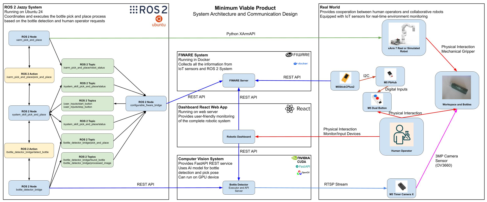
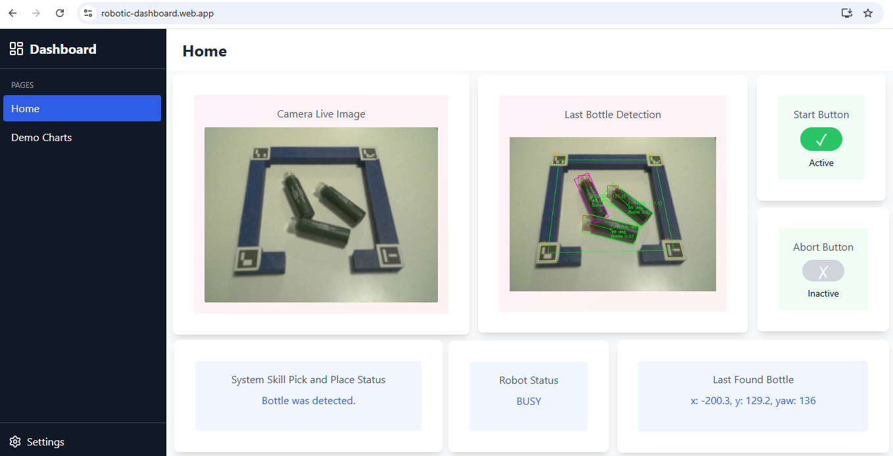

# Minimum Viable Product for Pick and Place Operation

This folder contains the proposed architecture of the minimum viable product for interaction between human and robot for a request of bottle pick and place operation.

The human operator uses IoT device to request the automatic bottle picking process. If there are no bottle left the operator can abort the process so that the operator can safely load new bottles in the bin.

The system is using a pretrained AI YOLO model for detection of the bottles. The coordination of the operation is done by ROS 2 system. The data gathered data from the ROS 2 system and the IoT sensors is contained within a FIWARE system which provides a useful API for further analysis and visualization. For the visualization a dedicated fully customizable dashboard is developed.

## System Architecture

The system architecture is shown in the following figure:

[](./images/system_architecture.jpg)

The system is divided into the following components.

### 1. ROS 2 System

ROS 2 is used to coordinate the pick and place operation. The developed ROS 2 nodes are providing bridges between the different APIs of the FIWARE, the AI vision system, the xArm robot, etc. The ROS 2 graph is shown in the following figure:

[](./images/rosgraph.png)

The pick and place operation is coordinated with a node which implements its logic by using the Behaviour Tree shown in the following figure:

[](./images/pick_and_place_behaviour_tree.png)

The developed ROS 2 nodes and more details can be found in the folder [ros2-fiware-xarm](./ros2-fiware-xarm/).

### 2. AI Bottle Detector System

The AI Bottle Detector is a stand-alone vision system. It can be executed on a dedicated machine with GPU, so that it can run faster. The system provides a REST API for managing bottle detection requests and for access to the live camera feed. The camera itself is supposed to be IoT type of device which allows access over RTSP.

The developed AI Bottle Detector and more details can be found in the folder [ai-bottle-detector](./ai-bottle-detector/).

### 3. FIWARE Platform

FIWARE is used as the central storage of the generated from the system modules. It provides a useful API for further access to this data. FIWARE is used as a stand-alone docker container. The only data which is not stored in the FIWARE are the actual images as FIWARE is not supposed to store such big chunks of data. Instead we are storing the URLs of the images generated by the AI vision system. The vision system is storing the images and they can be accessed by their URL.

The docker file for the FIWARE and more details can be found in the folder [fiware-docker](./fiware-docker/).

### 4. React Dashboard Web Application

React Dashboard Web Application is developed. It contains multiple types of widgets which can be added to the dashboard pages in order to visualize the data and the state of the system in a user friendly way.

Dashboard configured for the pick and place operation is shown in the following figure:

[](./images/react_dashboard_screenshot.png)

The React Dashboard and more details can be found in the folder [react-dashbord](./react-dashboard/).

### 5. IoT Devices

For the minimum viable product experiments M5Stack IoT devices are used. They provide an Arduino based libraries which can be used to send data over the Internet with HTTP requests. Those requests are used to send data to the FIWARE which can then be used by the ROS 2 control system. This allows easier integration of the IoT devices with ROS 2.

The sample Arduino firmware and more details can be found in the folder [arduino-iot-device-firmware](./arduino-iot-device-firmware/).

## System Start Up

Before the first start of the system you need to create all of the configuration files and the positions of all of the object within the workspace of the robot. Also, you might need to train the AI model for your specific type of bottles. More details can be found in the README.md file of the specific system component.

You will need to install the required Python packages and to build all of the ROS 2 packages.

After the system is configured, you can start it as follows.

1. Start the FIWARE Docker container
   ```sh
   cd fiware-docker
   docker-compose up -d
   ```
2. Start the camera and the other IoT devices
3. Start the AI Bottle Detector (the vision system)
   ```sh
   cd ai-bottle-detector
   uvicorn main:app --host 0.0.0.0 --port 22001
   ```
4. If you want you can start the React Dashboard and if needed to import the dashboard configuration
   ```sh
   cd react-dashboard
   npm run start
   ```
5. Start the ROS 2 nodes
   ```sh
   cd ros2-fiware-xarm/ros2_ws
   source /opt/ros/jazzy/setup.bash
   source install/setup.bash
   ros2 launch ./launch/complete.launch.py
   ```

Now, you can send the bottle pick and place request by pressing the blue button of the M5 Dual Button Unit.

## Video Demonstration

On the following URL you can find a video demonstration of the work of the system: TBD
